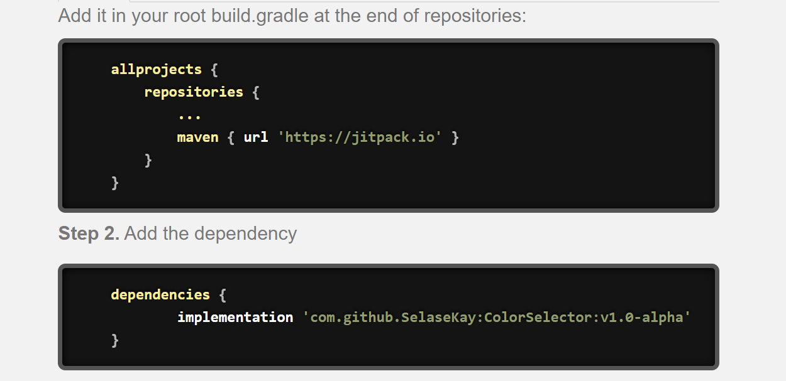
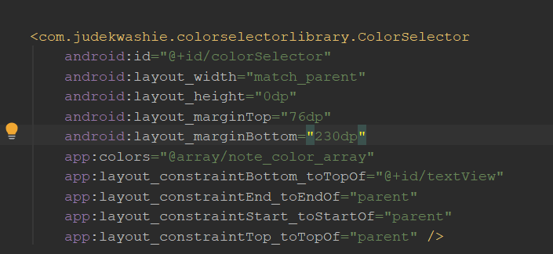
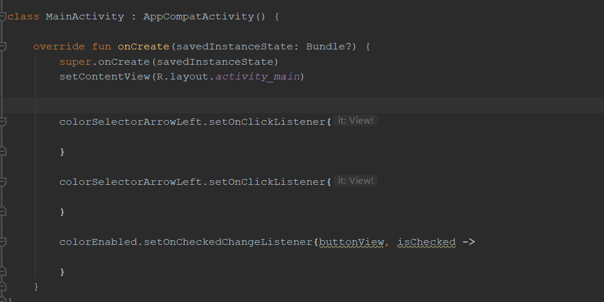

# ColorSelector

ColorSelector is library that providers developers with a compound custom view(**ColorSelector View**) as shown below. 

#### The Color Selector View

In order to use the ColorSelector library in your project, you need to add certain dependencies to your build.gradle file. The way to do this is displayed in the image below.

#### Adding The Dependencies

You can use the ColorSelector in your layout xml file once the dependencies are added and your project is synced. 

#### Using ColorSelector in Your Layout Files

Finally, the image below guides you on how to implement the listeners for the buttons(**right arrow**, **left arrow**, **checkbox**) in the ColorSelector View

#### Implementing Listeners

