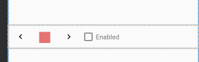

# ColorSelector

ColorSelector is library that providers developers with a compound custom view(**ColorSelector View**) as shown below. 

#### The Color Selector View

In order to use the ColorSelector library in your project, you need to add certain dependencies to your build.gradle file. The way to do this is displayed in the image below.

#### Adding The Dependencies

